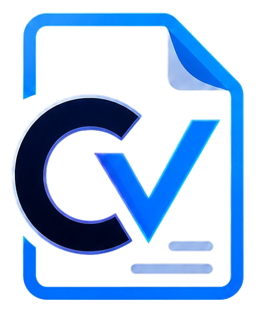
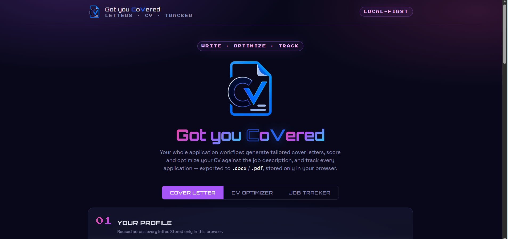

<p align="center">
  
</p>

<h1 align="center">Got you CoVered</h1>

<p align="center">
  Your whole job-application workflow in one place: write tailored cover letters, score and optimize your CV against any job description, and track every application. Powered by Claude, local-first.
</p>

<p align="center">
  <a href="https://got-you-covered-cv.vercel.app/"><b>Live app → got-you-covered-cv.vercel.app</b></a>
</p>

<p align="center">
  
</p>

---

## What it does

Three tools that share one profile and one job description, so you never re-enter anything.

### ✍️ Cover Letter generator
- Upload your resume (PDF or `.docx`) — parsed to editable text on upload.
- Paste the job description or give a URL (scraped server-side); company and role auto-detect.
- Optional always-applied instructions and an optional reference letter to emulate your voice and layout. Leave instructions blank to use a built-in default prompt.
- Strict word-count control (300–350 up to 500–550 words).
- Streams the letter into an editable view. Export to `.docx` / `.pdf` with real bold formatting, copy to clipboard, regenerate, and one-click **Track application**.

### 📄 CV Optimizer
- **Rate my CV** — a ruthless six-second-skim review against the job: a visual **score meter** out of 100, missing ATS keywords, red flags, and the highest-impact fixes, kept short and specific.
- **Optimize my CV** — rewrites your CV to match the job (JD keywords, XYZ bullets, project filtering) using **only facts from your CV**, nothing invented.
- Upload a **`.docx`** and the optimizer edits your **original file in place** — photo, fonts, and layout preserved. Upload a PDF and it produces a clean re-formatted version.
- Download `.docx` / `.pdf`, or push the optimized CV straight into the cover letter generator.

### 📊 Job Tracker
- Log every application (company, role, link, type, status) — up to 1000 entries.
- Live stats: applications today vs. an **adjustable daily goal**, totals per status, and rejection rate.
- Search and filter by status and type; edit status / type / notes inline.
- Add the current job with one click right after generating its cover letter.

## Privacy

Everything — resume, instructions, generated letters, optimized CVs, and tracked applications — is stored only in your own browser's `localStorage`. Nothing is persisted on a server. The Anthropic API is called server-side, so your API key never reaches the browser.

## Tech stack

Next.js (App Router) + TypeScript + Tailwind CSS. Anthropic SDK for generation, `pdf-parse` and `mammoth` for resume parsing, `@mozilla/readability` + `jsdom` for URL extraction, `jszip` for in-place `.docx` editing, `docx` and `jspdf` for exports.

## Running locally

```bash
git clone https://github.com/<your-username>/got-you-covered.git
cd got-you-covered
npm install
cp .env.example .env.local     # then paste your own ANTHROPIC_API_KEY
npm run dev
```

Then open http://localhost:3000.

`.env.local` keys:
```
ANTHROPIC_API_KEY=sk-ant-...
ANTHROPIC_MODEL=claude-sonnet-4-6   # optional override
```

## Notes

- PDF parsing uses `pdf-parse`; scanned / image-only PDFs won't extract text.
- URL extraction works on most pages but not on heavily JavaScript-rendered or login-gated sites (LinkedIn, Indeed, Glassdoor) — paste the text in that case.
- All exports embed a real text layer, so they are selectable and ATS-readable. If you re-save an exported file, use "Save as PDF" / "Export to PDF", never "Print to PDF", which turns text into an image that applicant tracking systems cannot read.
